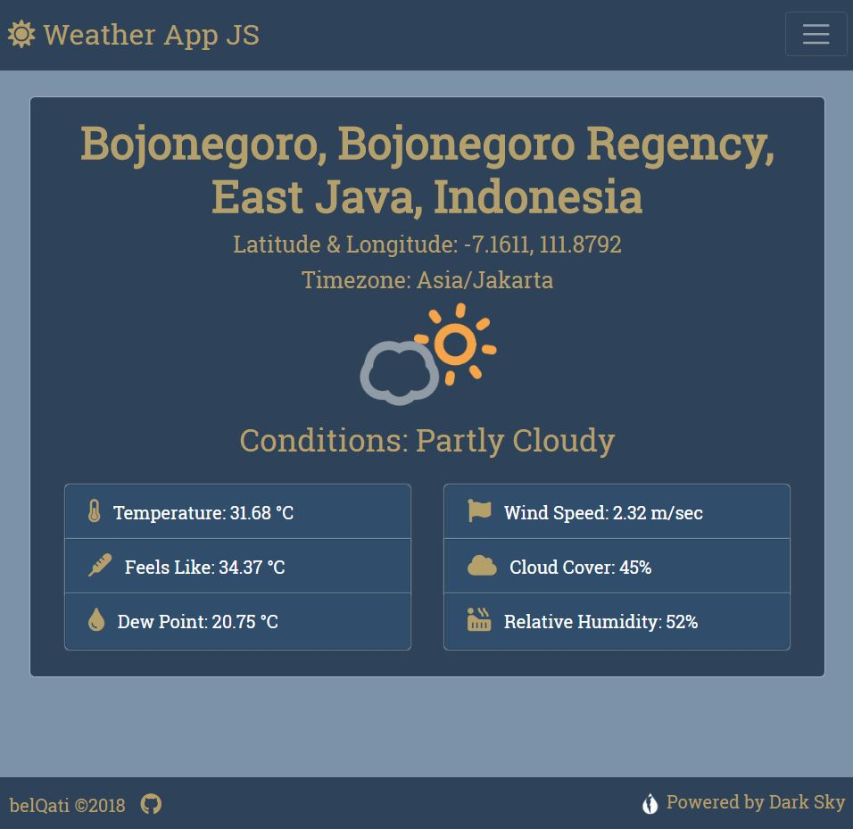
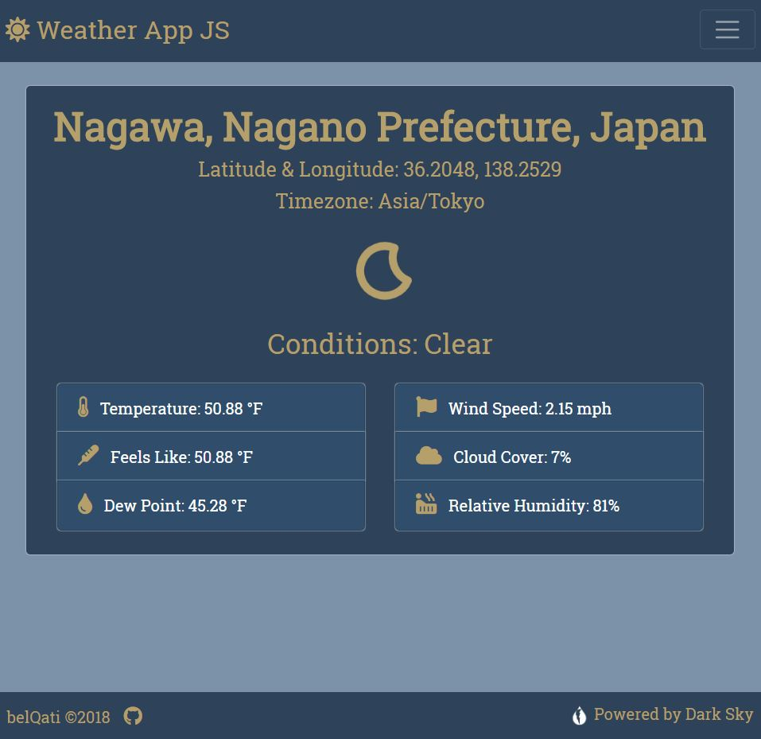
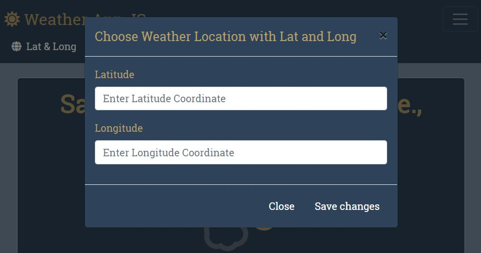
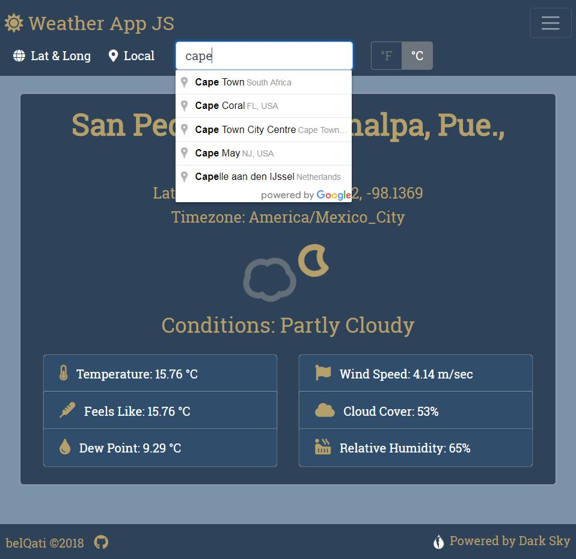
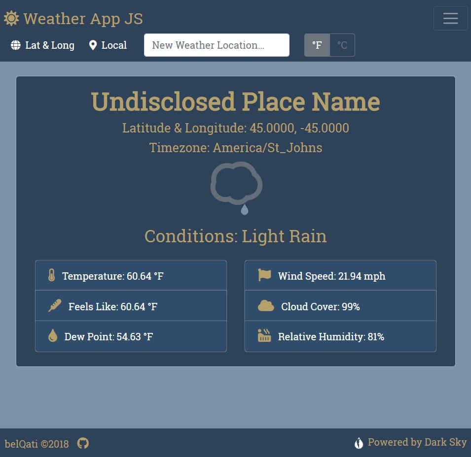
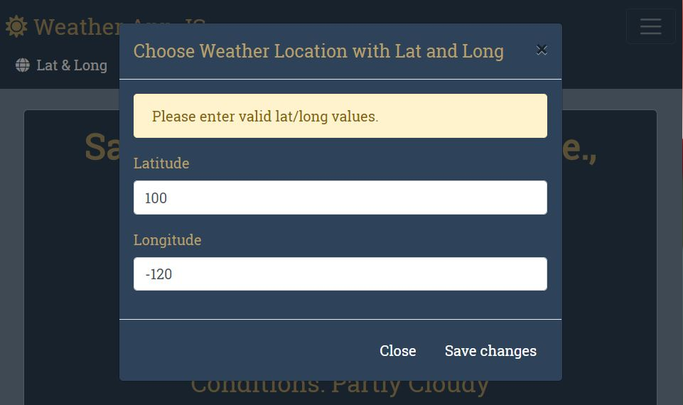
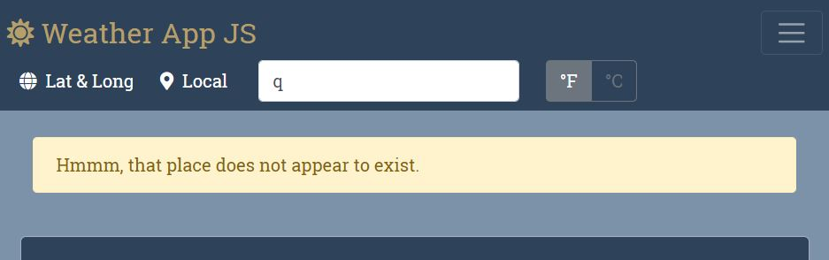
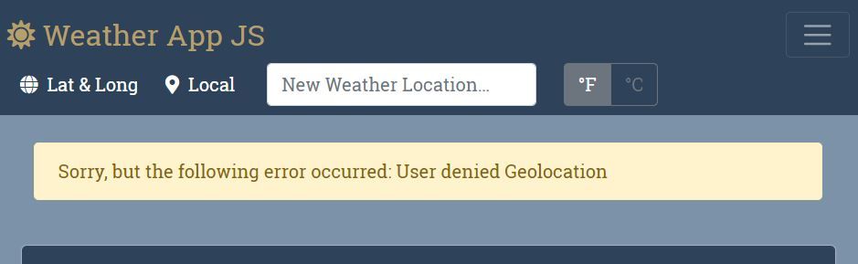
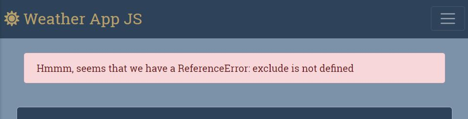

#  WeatherAppJS

*WeatherAppJS* is an app created in part under the direction of [Brad Traversy](https://www.udemy.com/modern-javascript-from-the-beginning/) in his *Modern JavaScript from the Beginning* course. The app uses the following technologies:

  * JavaScript ES6
  * HTML
  * CSS
  * Bootstrap 4
  * Google Maps API
  * Dark Sky API

Another weather API solution was necessary due to the policy changes in the Weather Underground API originally used by Brad. I have already used [OpenWeatherMap](https://www.openweathermap.org/api) and wanted to try something a bit different for this project: [Dark Sky](https://darksky.net). I also added the Google Maps API primarily for their place name library, as Dark Sky does not provide such a feature due to licensing restrictions (according to their dev docs).

The app needs to be refactored with a simple server in order to take advantage of environment variables using `dotenv`. If you wish to use this app for your own purposes, simply replace `process.env.DARKSKY_SECRET` and `process.env.GEOCODER_API_KEY` in `weather.js` with your own API keys for Dark Sky and Google Maps, respectively. If you do not have the former, create an account at [Dark Sky](https://darksky.net/dev/register) to obtain a free key. For Google's API's, well, Google it ;-).

### Description and Features

WeatherAppJS uses latitude and longitude variables to access the Dark Sky API. The response is limited to current conditions in order to improve response time, and displays the following results:

* Place Name
* Latitude & Longitude
* Timezone
* [Skycons](https://github.com/darkskyapp/skycons) Animation of Current Conditions
* Summary of Current Conditions
* Temperature
* Feels Like Temperature
* Dew Point
* Wind Speed
* Cloud Cover
* Relative Humidity

The [Skycons](https://github.com/darkskyapp/skycons) animation is slightly modified to better fit the color scheme of the current app, otherwise its original code is left "as-it-was-when-I-implemented-it." This data is tied to latitude and longitude, both of which are kept in `localStorage`, with assigned default values arbitrarily set for Nagawa, Japan, and for display units (currently Fahrenheit and mph). Defaults are changeable via `this.defaultLat`, `this.defaultLon`, and `this.defaultTempFC` in `public/scripts/storage.js`.

Local weather data populates the app with a click of a button using the user's `geolocation` data via their device. By clicking "Local," the user grants express permission for the app to access their current location.

Weather for a different location is obtained in one of two ways. The first is through entering valid latitude and longitude coordinates in a Bootstrap modal pop-up, accessible via the "Lat & Long" button.

The second, and more convenient, way to change weather locations is through the automated search menu powered by the Google places library API. Suggestions are automatically offered the user as they type, where the app then populates weather data based on the user's selection.

All methods for changing weather locations immediately send the new latitude and longitude coordinates to `localStorage`. Similarly, the user can toggle the display units, with their final choice stored in `localStorage`. All user selections then persist on refresh.

### Error Handling

An absent place name value is clearly marked, rather than displaying no data, `null`, or `undefined`: e.g., if a user enters latitude and longitude for an ocean location, it will bear "Undisclosed Place Name" with its weather data.

All remaining errors are handled through temporary alerts communicating the situation to the user. Latitude and longitude values must be legitimate, or the user recieves a prompt to enter valid coordinates.

While the Google places API makes it easy to select a valid address, an invalid entry results in an alert. Geolocation errors are also handled via alert.

Finally, an alert lets the user know should a query fail for some reason.

